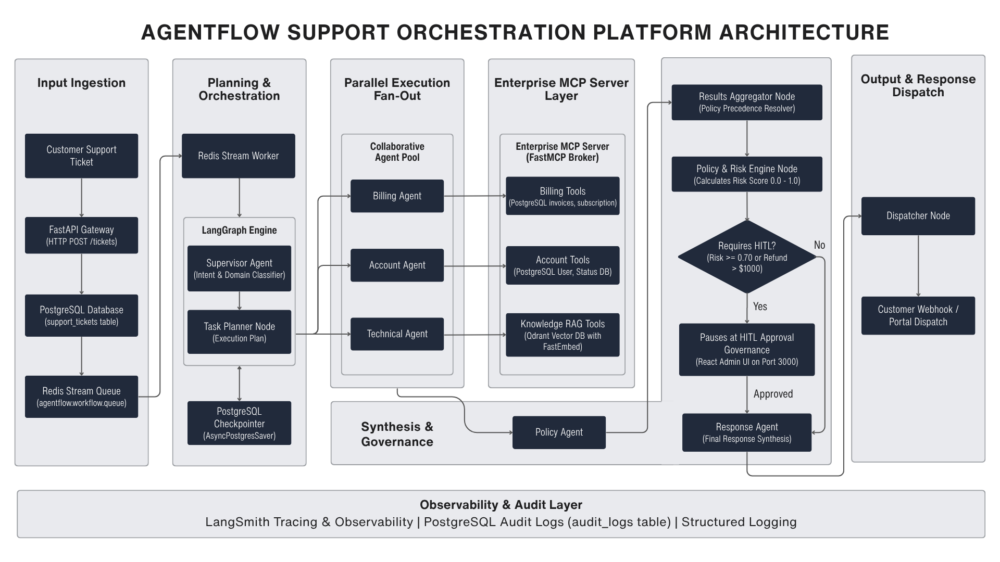

<div align="center">

# AgentFlow AI

### Autonomous Support Orchestration Platform

**A support ticket goes in. A deterministic, auditable, human-supervised multi-agent workflow resolves it.**

[](https://www.python.org/)
[](https://fastapi.tiangolo.com/)
[](https://langchain-ai.github.io/langgraph/)
[](https://modelcontextprotocol.io/)
[](https://qdrant.tech/)
[](https://www.postgresql.org/)
[](https://react.dev/)
[](https://docs.docker.com/compose/)

[](#testing)
[](#testing)
[](#roadmap)

</div>

---

## Overview

AgentFlow AI is an enterprise multi-agent customer operations platform for B2B SaaS.

A ticket such as *"I was charged twice for my enterprise subscription and my dashboard is locked"* is classified, decomposed into an execution plan, and resolved by specialised agents running in parallel — with RAG-grounded knowledge, MCP-mediated enterprise access, a deterministic risk gate, and human approval before anything risky reaches a customer.

The design principle that shapes every file in this repository:

> **LLMs decide. LangGraph controls flow. MCP performs I/O.**
>
> An agent that "just queries Postgres directly" breaks the entire model.

`srs.md` is the authoritative specification. `docs/INTERVIEW_KNOWLEDGE_BASE.md` explains *why* each decision was made and what was rejected.

---

## Architecture

<div align="center">
  
</div>

Every node checkpoints to PostgreSQL, so a workflow survives a process restart and resumes exactly where it paused. Human approval is a LangGraph `interrupt()` on that same thread — approval **resumes** a workflow, it never restarts one.

### Layer responsibilities

| Layer | Responsibility | Forbidden |
|-------|----------------|-----------|
| **FastAPI** | HTTP only. Validate, queue, return `202`. | Calling an LLM or MCP |
| **LangGraph** | Orchestration. Owns `GraphState`, routing, checkpoints, interrupts. | Business persistence inside nodes |
| **Agents** | Reasoning only. | SQL, HTTP, env vars, agent-to-agent calls |
| **Enterprise MCP** | The only path to enterprise data. 12 namespaced tools, every call audited. | Being reached by anything but a `ToolNode` |
| **Qdrant** | RAG knowledge base. Retrieve before generating. | Filling a gap when retrieval is thin |
| **PostgreSQL** | Business data, checkpoints, audit logs. | — |
| **Redis** | Work queue and ephemeral runtime memory. | Permanent customer records |

### Invariants

1. **Reasoning is separate from execution.** Agents emit `tool_call`s; a LangGraph `ToolNode` intercepts them and calls the MCP client. Only the ToolNode talks to MCP.
2. **GraphState is the single source of truth.** Nodes return update dicts and never mutate state in place. Any field written by parallel agents carries a reducer — otherwise LangGraph raises `InvalidUpdateError`.
3. **Governance is deterministic.** The Risk Engine is plain Python with no LLM call, so an identical workflow state always produces an identical approval decision. An LLM here would make approvals unauditable.
4. **Everything is auditable.** Approvals, conflicts, tool calls and workflow outcomes all leave rows in `audit_logs`.

### The graph

11 nodes, 6 of which reason and 5 of which are deterministic Python:

| Node | Kind | Role |
|------|------|------|
| `supervisor` | LLM | Intent and domain classification |
| `task_planner` | deterministic | Supervisor output → ordered `ExecutionTask` list |
| `billing_agent` · `account_agent` · `technical_agent` | LLM + tools | Parallel, plan-driven fan-out |
| `policy_agent` | LLM | Compliance verdict; **wins all conflicts** |
| `results_aggregator` | deterministic | Merge results, detect conflicts |
| `risk_engine` | deterministic | Owns `risk_score`, `requires_hitl` |
| `human_approval` | deterministic | `interrupt()` — unparseable decision is treated as rejection |
| `response_agent` | LLM | Customer reply from `GraphState` only |
| `dispatcher` | deterministic | Delivery; owns terminal `completed` |

### Services

| Service | Port | Role |
|---------|------|------|
| `frontend` | 3000 | Operations console (React + nginx) |
| `backend` | 8000 | REST API; runs migrations on boot |
| `enterprise-mcp` | 8001 | MCP tool server |
| `dispatcher` | – | Executes workflows; **the only service needing `GROQ_API_KEY`** |
| `postgres` | 5432 | Business data, checkpoints, audit |
| `redis` | 6379 | Workflow queue |
| `qdrant` | 6333 | Vector knowledge base |

---

## Quickstart

```bash
cp .env.example .env          # set GROQ_API_KEY to run real workflows
docker compose up --build
docker compose exec backend python -m scripts.seed_database
docker compose exec backend python -m scripts.ingest_knowledge
```

| | |
|---|---|
| **Operations console** | <http://localhost:3000> |
| **API docs** | <http://localhost:8000/docs> |
| **Health** | <http://localhost:8000/health> |

Migrations run automatically when the backend boots.

> **Ticket stuck at `pending`?** The dispatcher is the only service that calls the LLM. Check it first:
> ```bash
> docker compose logs -f dispatcher
> ```
> Without a `GROQ_API_KEY` everything starts and the API works, but a queued workflow fails at the Supervisor.

<details>
<summary><b>Local development (no containers for the app tier)</b></summary>

```bash
python -m venv .venv
.venv\Scripts\activate                     # source .venv/bin/activate on Unix
pip install -r requirements.txt
docker compose up -d postgres redis qdrant
alembic upgrade head
python -m scripts.seed_database
uvicorn app.main:app --reload
```

Frontend:

```bash
cd frontend && npm install && npm run dev   # http://localhost:5173
```

The Vite dev server proxies API paths to `localhost:8000`, so no CORS setup is needed.

</details>

<details>
<summary><b>Rebuilding after a backend change</b></summary>

```bash
docker compose up -d --build --force-recreate backend enterprise-mcp dispatcher
```

A plain `up -d --build` leaves already-running containers on their old image — which surfaces as new endpoints 404ing and `alembic current` failing to find a revision that exists on disk.

</details>

---

## API

| Method | Path | Purpose |
|--------|------|---------|
| `POST` | `/tickets` | Submit a ticket. Returns `202` immediately with a `workflow_id`. |
| `GET` | `/tickets` | List tickets with workflow state, tier and priority. |
| `GET` | `/tickets/{ticket_id}` | Ticket detail and resolution. |
| `GET` | `/workflows` | List workflow runs. |
| `GET` | `/workflows/{workflow_id}` | Workflow status. |
| `GET` | `/workflows/{workflow_id}/trace` | Step-by-step execution trace. |
| `GET` | `/workflows/{workflow_id}/approval` | Full HITL review packet. |
| `POST` | `/approvals/{workflow_id}` | Record a reviewer's decision and resume. |
| `GET` | `/metrics` | Dashboard counters. |
| `GET` | `/health` | Component health. |

```bash
curl -X POST localhost:8000/tickets \
  -H 'content-type: application/json' \
  -d '{"customer_id":"<uuid>","subject":"Charged twice","description":"Two identical charges this month."}'
# 202 Accepted → {"workflow_id": "...", "ticket_id": "...", "status": "pending"}
```

The field is `subject`, not `title`. `POST /approvals/{id}` takes `{approved, reviewer_name, comments}` and returns `409` if the workflow is not awaiting approval.

The list, trace, approval-packet and metrics endpoints are additions beyond SRS §36, which specifies only single-resource reads; the operations console cannot function without them.

---

## Enterprise MCP tools

One server, 12 namespaced tools, every call audited on success *and* failure.

| Namespace | Tools |
|-----------|-------|
| `billing_` | `get_invoice` · `get_subscription` · `calculate_refund` |
| `account_` | `get_customer` · `unlock_dashboard` · `update_feature_flag` |
| `ticket_` | `get_ticket` · `update_ticket` · `add_internal_note` |
| `knowledge_` | `semantic_search` · `search_policy` · `search_runbook` |

Tool access is scoped per agent — the Technical agent binds only `knowledge_semantic_search`. Retries follow SRS §41: only structured `timeout` codes and transport errors retry, max 3 attempts with exponential backoff, and exhaustion degrades to a structured `unavailable` result rather than raising.

```bash
docker compose exec -T backend python -c \
  "import asyncio; from app.mcp.client import EnterpriseMCPClient; \
   print(asyncio.run(EnterpriseMCPClient('http://enterprise-mcp:8000').list_tools()))"
```

---

## Testing

```bash
pytest                                       # from the local venv
pytest --cov=app --cov-report=term-missing   # target >=80%
pytest tests/test_e2e.py -v                  # end-to-end pipeline
```

**400 tests · 92% coverage · no Groq key or running infrastructure required.**

`pytest` runs from the venv, **not** inside the container — the image does not ship `tests/`.

`tests/test_e2e.py` drives the whole pipeline as one system: `POST /tickets` → Redis stream → consumer → runner → compiled graph → HITL interrupt → `POST /approvals/{id}` → resume → response → dispatcher → persisted resolution.

| Real | Substituted |
|------|-------------|
| FastAPI app, both services, queue envelope, consumer group and ACK semantics, runner, every graph node and edge, the checkpointer, MCP runtime with audit writes | Groq (`ScriptedLLM`), Qdrant (`RecordingRetriever`), Redis (`FakeRedisStream`) |

These prove the *system wiring*. They cannot prove the Groq model behaves well — no offline test can.

Frontend:

```bash
cd frontend
npm run build    # tsc -b && vite build — must be clean
npm run lint     # eslint — must be clean
```

---

## Observability

Structured logs are always on; every node logs `workflow_id`, node name, execution time, tool calls and retry count.

OpenTelemetry tracing (SRS §42) is **off by default** — the unit suite, a local venv and any offline run must work with no collector listening.

```bash
OTEL_ENABLED=true docker compose up                                                  # spans to container logs
OTEL_ENABLED=true OTEL_EXPORTER_OTLP_ENDPOINT=http://jaeger:4318 docker compose up   # export to a collector
```

Spans cover FastAPI requests, LangGraph nodes and MCP tool calls, and carry ids, durations, counts and status codes **only** — never customer data. A `GraphInterrupt` is control flow, not a failure, so a human approval does not appear as a fault in the trace.

**Where the time actually goes** (measured on a real duplicate-charge workflow):

| Node | Time |
|------|------|
| `supervisor` | 4,548 ms |
| `billing_agent` (5 tool calls) | 11,920 ms |
| `response_agent` | 2,285 ms |
| `policy_agent` | 672 ms |
| `task_planner` | 1 ms |
| `results_aggregator` · `risk_engine` · `dispatcher` | 0 ms |

Nearly all wall-clock is LLM inference. The deterministic governance nodes are already free.

---

## Configuration

All settings come from `.env` (see `.env.example`). The ones that matter most:

| Variable | Default | Notes |
|----------|---------|-------|
| `GROQ_API_KEY` | – | Required for real workflow execution. |
| `HITL_REFUND_THRESHOLD` | `1000.0` | Refunds above this need human approval. |
| `HITL_CONFIDENCE_THRESHOLD` | `0.6` | Agent confidence below this routes to review. |
| `RAG_SCORE_THRESHOLD` | `0.6` | Below this, retrieval reports insufficient information. |
| `EMBEDDING_MODEL` | `BAAI/bge-small-en-v1.5` | 384 dims. Ingestion and query must use the same model. |
| `OTEL_ENABLED` | `false` | Enables tracing. |

If human approval fires more often than a demo wants, tune the HITL thresholds or the Policy prompt rather than weakening the Risk Engine — **the governance path working is the feature.**

---

## Roadmap

All 8 phases are complete.

| # | Phase | Delivered |
|---|-------|-----------|
| 1 | Foundation | PostgreSQL, Redis, FastAPI, models, migrations, Docker |
| 2 | Orchestration | `GraphState`, Supervisor, deterministic Task Planner |
| 3 | Enterprise MCP | FastMCP server, 12 tools, audit runtime, MCP client |
| 4 | Agents | 5 specialised agents, `ToolNode`, retry policy, parallel fan-out |
| 5 | RAG | Qdrant, FastEmbed, chunking, ingestion, grounded retrieval |
| 6 | Governance | Aggregator, Risk Engine, HITL, Postgres checkpointer, queue dispatcher |
| 7 | Operations console | React dashboard, execution trace, approval workflow |
| 8 | Observability | OpenTelemetry, end-to-end suite, documentation |

---

## Known limitations

- **No authentication.** SRS §43 specifies JWT and RBAC; neither is implemented anywhere in the system. Anyone who can reach the API or the dashboard can read every ticket and approve any paused workflow. Acceptable for local development only — **this must be resolved before any shared deployment**, and it is the largest outstanding gap against the SRS.
- **Single-tenant.** No tenant isolation in the schema or the queue.
- **Polling, not streaming.** The dashboard polls (tickets and metrics at 4s, the trace at 2s); there is no websocket or SSE channel.

---

## Repository layout

```
app/
  api/            FastAPI routes — HTTP only
  agents/         The five reasoning agents + shared tool loop
  graph/          GraphState, nodes, routing, workflow assembly, checkpointer
  mcp/            Enterprise MCP server, tools, runtime, client
  rag/            Chunking, embeddings, Qdrant store, retriever
  dispatcher/     Redis Streams consumer + WorkflowRunner
  services/       Business logic (ticket, billing, account, knowledge, approval)
  models/         SQLAlchemy 2.x models
  observability/  Structured logging + OpenTelemetry
frontend/         Vite + React 19 + TypeScript + Tailwind 4 operations console
docs/knowledge/   RAG seed corpus
tests/            400 tests, incl. the end-to-end pipeline suite
```

<div align="center">
<br>

**[Specification](./srs.md)** · **[Architecture deep-dive](./docs/INTERVIEW_KNOWLEDGE_BASE.md)** · **[Contributor guide](./CLAUDE.md)**

</div>
